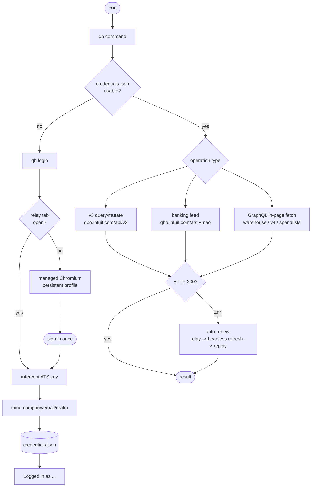

# qb — QuickBooks Online CLI

[](https://github.com/mvanhorn/cli-printing-press/actions/workflows/lint.yml)
[](go.mod)
[](LICENSE)

`qb` drives the whole of QuickBooks Online (AU) from the terminal: books, banking feeds, sales, expenses, payroll, tax, inventory, reports — 561 catalogued operations across 16 domains, with live reads, live writes, dry-runs, and an authenticated session that heals itself. Built agent-first (`--json` everywhere, `qb actions` as a machine-readable contract), equally usable by humans.

Printed by the [Printing Press](https://printingpress.dev) (`cli-printing-press`, same repo) from the official v3 API, the QBO webapp's own captured GraphQL, and the banking-feed surfaces Intuit never published.

## Quickstart

```bash
go build -o qb ./cmd/qb
./qb login                 # sign in once (managed Chromium window)
./qb auth whoami           # Signed in live as <company> (<email>, realm <id>)
./qb auth keepalive status --json
./qb company company-info get
```

`login` tries, in order: an already-open QBO tab (Chrome relay) → a **managed Chromium profile** (`~/.config/qb/profiles/qbo`, reused across logins) → an isolated browser Space. You sign in; `qb` mines the ATS session, cookies, and company identity. Every success leads with the bound company — you always know which books you're touching.

## Auth model

- **Session rules.** No configured company, no allowlist: every command operates on whatever company you signed in as. Verify anytime with `qb auth whoami` (live tab) or `qb auth status --live` (v3 ping: `live` / `STALE` / `unknown`).
- **Session maintenance is the default.** Login starts a profile-bound background keeper with read-only probes every five minutes. Rotated cookies are persisted; recovery stays in the same company/principal and respects logout. Safe reads can recover once after a 401; writes are not blindly repeated. `qb auth keepalive stop` stops maintenance; `login --keep-alive=false` or `QB_NO_KEEPALIVE=1` disables automatic startup. `QB_NO_MANAGED=1` disables managed-browser recovery. Intuit can still require sign-in/MFA.
- Secrets live only in `~/.config/qb/credentials.json` (0600). `--json` output never includes them.

See [session lifecycle and controls](docs/SESSION_LIFECYCLE.md) for recovery, backoff and provider limits.

## Coverage (561 primitives)

| Domain | Wired | Read | Command root |
|---|---|---|---|
| Accounting (COA, class, budget, journals, fixed assets, CDC) | 37 | 30 | `qb accounting` |
| Expenses (bills, suppliers, cheques, time activities) | 37 | 22 | `qb expenses` |
| Sales (invoices, estimates, payments, sends, PDFs, sales orders) | 38 | 21 | `qb sales` |
| Company (settings, users, lists, attachables, rates) | 24 | 28 | `qb company` |
| Feed (banking classify/split/exclude/undo) | 14 | 11 | `qb feed` |
| Payroll (pay runs, STP, super) | 5 | 3 | `qb payroll` |
| Tax (GST, BAS, TPAR, agencies, codes) | 2 | 10 | `qb tax` |
| Inventory (items, purchase orders) | 10 | 9 | `qb inventory` |
| Customers | 9 | 11 | `qb customers` |
| Reports + forecasts | 12 | 43 | `qb reports` |
| GraphQL (captured webapp ops) | 8 | 3 | `qb gql` |
| Cost groups, custom objects, accountant | 3 | 1 | `qb costgroups`, `qb customobjects`, `qb accountant` |
| Integrations, advanced (service maps, batch) | 8 | 5 | `qb integrations`, `qb advanced` |

`qb crm` and `qb salestx` are additional command trees outside the actions catalog. `salestx` includes live v3 sales transactions and tax-service operations; its plan IDs are command identifiers, not catalog entries.

`qb policy` is also outside the catalog: a read-only, offline surface for embedded company accounting policy (Mega Style Apartments profile). It serves the reference docs (`docs`/`doc`), the machine-readable rules (`rules`/`rule`), journal-pair templates, account/class lookups (`accounts`/`classes`), the 20.9% fee calculator (`management-fee`), the owner-statement equation (`owner-net` — revenue from a class-filtered P&L via `--pnl`, deductions from posted journals via `--journals`), a posted-pattern suggester (`categorise`), and a pre-flight journal validator (`check-journal`) that accepts either a v3 JournalEntry or the `--items-json` create shape, decomposes balanced multi-pair entries, and exits nonzero on `fail`/`unverified` verdicts.

Totals: **207 wired, 197 read-only, 155 blocked, 2 excluded of 561 actions.** Run `qb actions` for exact per-row counts — the table above is the map, the catalog is the truth.

OCR receipt read/search/delete aliases are blocked: they previously targeted v3 attachments, a different resource from financialdocument/stagetransactions receipts. Receipt upload and receipt-to-expense remain available. Invoice reminders preview by default; `--send` explicitly sends, is refused under verification harnesses, and reports delivery as unverified when QBO returns only an empty acknowledgement.

Examples:

```bash
qb feed txn list --account-id 44 --limit 5
qb accounting class create --name "Marketing"   # then get / update / delete
qb sales invoice get --id 198
qb company company-info get
qb reports profit-loss get --report ProfitAndLoss --date-range 2026-07-01,2026-09-01
qb reports profit-loss-detail get --klass 3700000000000906240 --accounting-method cash   # one class's detail
qb reports saved list --query "Melo"                    # saved custom-report definitions (klass/account filters inside dataRequest)
qb actions --mode wired --json | jq '.[].id'
```

## Banking feeds

The differentiator: full replay of the QBO banking UI — pending/excluded/register views, classify, split, exclude, undo, CSV import — with `qb doctor` gating session health first and `--dry-run` planning every mutation before it dials.

```bash
qb doctor
qb feed txn list --account-id 44
qb feed txn import --account-id 44 --file rows.csv --dry-run
```

## Captured GraphQL

`qb gql` runs operations captured from the production webapp (293 in catalog, 11 wired to verbs) inside your authenticated tab:

```bash
qb gql ops Commerce        # browse offline
qb gql mutate receive-inventory --txn-id 198 --txn-type Bill --lines-json '[...]'
qb gql query CommerceInventoryMovement --help
```

## Safety

- `--dry-run` plans any mutation without dialing.
- Writes announce their target; `whoami`/`status` always show the bound company.
- There is no safety allowlist: `qb` writes to the signed-in company. Check `whoami` before bulk jobs.

## vs the official MCP server

Compared tool-for-tool against [`intuit/quickbooks-online-mcp-server`](https://github.com/intuit/quickbooks-online-mcp-server)
(142 tools, read from its `src/tools/*.tool.ts` + handlers, not its docs).
It speaks only the official OAuth v3 API and needs an Intuit developer app
(`QUICKBOOKS_CLIENT_ID/SECRET`, refresh token in env). `qb` signs in as you
and additionally replays the webapp's own surfaces — no developer app.

**Entire surfaces the MCP server has nothing for:** banking feeds
(classify/split/exclude/undo/import, 37 rows), payroll (38), AU tax
(GST/BAS/TPAR reads), captured webapp GraphQL (11 verbs, 8 wired: inventory
movements, product activation, reconcile…), inventory adjustments, cost
groups, custom/forecast/management/performance reports, company
settings/users/roles/tags/currency, audit log, recurring transactions,
projects, mileage/cheques/bank fees, sales orders, customer/supplier
overviews and proposals.

**Also covered:** attachable file upload + CRUD, Department and TimeActivity
CRUD + search, Profit-and-Loss and Balance Sheet reports, Preferences,
vendor/customer balances, customer sales, vendor expenses, Purchase search,
invoice/estimate/credit-memo/receipt PDF download and sends, CDC change
streams, ExchangeRate/CustomerType/CreditCardPayment reads, TaxCode create
via taxservice (with agency + rate creates), webhook HMAC verify, and detail
reports (ProfitAndLossDetail, InventoryValuation, TransactionList,
JournalReport). v3 CRUD on the ~25 core entities (bill, invoice, customer,
vendor, item, account, …) is covered by both.

**Out of scope:** current-user needs OAuth bearer (not the session model);
Desktop IIF import targets QuickBooks Desktop, not Online.


## How it works



## Develop

```bash
go build ./... && go test ./internal/quickbooks/... -count=1
```

Layout: `cmd/qb` (entrypoint) · `internal/quickbooks/{cli,client,auth,gql,doctor}` (product) · `internal/pressauth` (managed-Chrome auth) · `internal/quickbooks/gql/gen` (catalog generator; `catalog_data.go` is generated — fix the generator, never the file).

## The Press

This repo also holds `cli-printing-press`, the generator that printed `qb` (API studies, sniffing, verification, skills + MCP output). `qb` is its reference print. See [printingpress.dev](https://printingpress.dev).

Printing Press runs generate their working CLI at `~/printing-press/.runstate/<scope>/runs/<run-id>/working/<api>-pp-cli` and promote it to the local library at `~/printing-press/library/<api>`. Archived manuscripts live at `~/printing-press/manuscripts/<api>/<run-id>/`, with `research/`, `proofs/`, `discovery/`, and `pipeline/` evidence. See [Local Artifacts and Public Library](docs/ARTIFACTS.md) for the artifact lifecycle.
